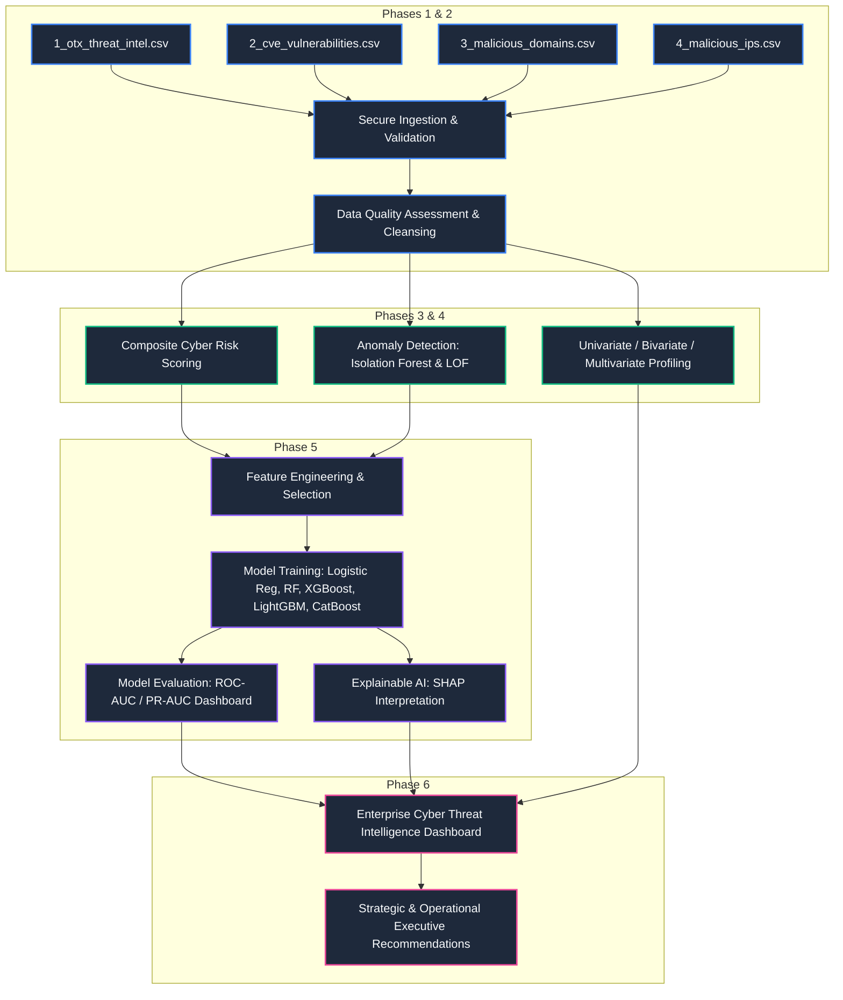

<!-- ═══════════════════════════════════════════════════════════════════════════════ -->
<!-- 🌊 ANIMATED WAVE HEADER — Live Gradient Animation (renders live on GitHub) -->
<!-- ═══════════════════════════════════════════════════════════════════════════════ -->
<p align="center">
  
</p>

<!-- ═══════════════════════════════════════════════════════════════════════════════ -->
<!-- ⌨️ ANIMATED TYPING SVG — Live Typing Effect (types & loops on GitHub)       -->
<!-- ═══════════════════════════════════════════════════════════════════════════════ -->
<p align="center">
  <a href="https://github.com/Shrutijaiswal26/Cybersecurity-Attacks-Defense-Analytics">
    
  </a>
</p>

<!-- ═══════════════════════════════════════════════════════════════════════════════ -->
<!-- 🏷️ TECH STACK BADGES — Premium for-the-badge Style                          -->
<!-- ═══════════════════════════════════════════════════════════════════════════════ -->
<p align="center">
  
  
  
  
  
  
  
  
  
  
  
  
  
</p>

<!-- ═══════════════════════════════════════════════════════════════════════════════ -->
<!-- 🏆 GITHUB TROPHY DISPLAY — Live Animated Trophies                           -->
<!-- ═══════════════════════════════════════════════════════════════════════════════ -->
<p align="center">
  <a href="https://github.com/Shrutijaiswal26">
    
  </a>
</p>

<!-- ═══════════════════════════════════════════════════════════════════════════════ -->
<!-- 📊 LIVE GITHUB STATS — Auto-updating Cards on every page load               -->
<!-- ═══════════════════════════════════════════════════════════════════════════════ -->
<p align="center">
  <a href="https://github.com/Shrutijaiswal26">
    
  </a>
  &nbsp;
  <a href="https://github.com/Shrutijaiswal26">
    
  </a>
</p>

<p align="center">
  <a href="https://github.com/Shrutijaiswal26">
    
  </a>
</p>

<!-- ═══════════════════════════════════════════════════════════════════════════════ -->
<!-- 📈 LIVE GITHUB ACTIVITY GRAPH — Animated contribution chart                 -->
<!-- ═══════════════════════════════════════════════════════════════════════════════ -->
<p align="center">
  <a href="https://github.com/Shrutijaiswal26/Cybersecurity-Attacks-Defense-Analytics">
    
  </a>
</p>

<!-- ═══════════════════════════════════════════════════════════════════════════════ -->
<!-- 🐍 CONTRIBUTION SNAKE — Animated SVG snake eating contributions              -->
<!-- ═══════════════════════════════════════════════════════════════════════════════ -->
<p align="center">
  <picture>
    <source media="(prefers-color-scheme: dark)" srcset="https://raw.githubusercontent.com/Shrutijaiswal26/Shrutijaiswal26/output/github-snake-dark.svg" />
    <source media="(prefers-color-scheme: light)" srcset="https://raw.githubusercontent.com/Shrutijaiswal26/Shrutijaiswal26/output/github-snake.svg" />
    
  </picture>
</p>

<!-- ═══════════════════════════════════════════════════════════════════════════════ -->
<!-- 🔴 LIVE REPO METRICS — Real-time badges (update on every page view)         -->
<!-- ═══════════════════════════════════════════════════════════════════════════════ -->
<p align="center">
  <a href="https://github.com/Shrutijaiswal26/Cybersecurity-Attacks-Defense-Analytics/stargazers"></a>
  <a href="https://github.com/Shrutijaiswal26/Cybersecurity-Attacks-Defense-Analytics/network/members"></a>
  <a href="https://github.com/Shrutijaiswal26/Cybersecurity-Attacks-Defense-Analytics/issues"></a>
  <a href="https://github.com/Shrutijaiswal26/Cybersecurity-Attacks-Defense-Analytics"></a>
  <a href="https://github.com/Shrutijaiswal26/Cybersecurity-Attacks-Defense-Analytics/commits/main"></a>
  <a href="https://github.com/Shrutijaiswal26/Cybersecurity-Attacks-Defense-Analytics/blob/main/LICENSE"></a>
</p>

<!-- ═══════════════════════════════════════════════════════════════════════════════ -->
<!-- 👁️ LIVE VISITOR COUNTER — Increments on every unique page view              -->
<!-- ═══════════════════════════════════════════════════════════════════════════════ -->
<p align="center">
  
  &nbsp;
  
  &nbsp;
  
  &nbsp;
  
</p>

<!-- ═══════════════════════════════════════════════════════════════════════════════ -->
<!-- 🚀 INTERACTIVE CLOUD LAUNCH — One-click execution environments              -->
<!-- ═══════════════════════════════════════════════════════════════════════════════ -->
<p align="center">
  <a href="https://colab.research.google.com/github/Shrutijaiswal26/Cybersecurity-Attacks-Defense-Analytics/blob/main/Cybersecurity%20Attacks%20%26%20Defense%20Analytics.ipynb">
    
  </a>
  &nbsp;
  <a href="https://mybinder.org/v2/gh/Shrutijaiswal26/Cybersecurity-Attacks-Defense-Analytics/main?filepath=Cybersecurity%20Attacks%20%26%20Defense%20Analytics.ipynb">
    
  </a>
  &nbsp;
  <a href="https://github.com/Shrutijaiswal26/Cybersecurity-Attacks-Defense-Analytics">
    
  </a>
  &nbsp;
  <a href="https://www.kaggle.com/datasets/chuneeb/ai-cybersecurity-threat-dataset-2026">
    
  </a>
</p>

<!-- ═══════════════════════════════════════════════════════════════════════════════ -->
<!-- 🌊 ANIMATED WAVE DIVIDER                                                    -->
<!-- ═══════════════════════════════════════════════════════════════════════════════ -->


---

# AI-Powered Cyber Threat Intelligence, Vulnerability Analytics, Malicious Infrastructure Detection, and Machine Learning Security Intelligence Platform

<p align="center">
  <a href="https://github.com/Shrutijaiswal26/Cybersecurity-Attacks-Defense-Analytics">
    
  </a>
</p>


---

## 📖 Table of Contents

<details open>
<summary><b>🗂️ Click to Expand / Collapse Navigation</b></summary>

| # | Section | Description |
|:-:|:--------|:------------|
| 01 | [🎯 Project Overview](#-project-overview) | Enterprise-grade threat analytics platform overview |
| 02 | [🏗️ System Pipeline Architecture](#️-system-pipeline-architecture) | End-to-end security intelligence pipeline (Mermaid) |
| 03 | [📊 Dataset Ingestion & Profiles](#-dataset-ingestion--profiles) | Four primary security telemetry datasets |
| 04 | [📝 Detailed Data Dictionaries](#-detailed-data-dictionaries) | Complete field-level documentation |
| 05 | [📂 System Directory Structure](#-system-directory-structure) | Repository layout and file roles |
| 06 | [⚙️ Installation & Setup](#️-installation--setup) | Prerequisites and environment configuration |
| 07 | [🚀 Jupyter Notebook Execution Guide](#-jupyter-notebook-execution-guide) | Step-by-step execution instructions |
| 08 | [☁️ Live Cloud Execution](#️-live-cloud-execution--interactive-environments) | Google Colab & Binder environments |
| 09 | [🧮 Mathematical Formulations](#-mathematical-formulations--scoring-metrics) | Custom risk scoring equations |
| 10 | [📈 Statistical Hypothesis Testing](#-statistical-hypothesis-testing) | Shapiro-Wilk, Chi-Square, Kruskal-Wallis |
| 11 | [🤖 ML & Explainable AI Pipeline](#-machine-learning--explainable-ai-pipeline) | 5 classifiers, clustering, anomaly detection, SHAP |
| 12 | [🔍 30-Section Analytical Workflow](#-granular-30-section-analytical-workflow) | Granular phase-by-phase breakdown |
| 13 | [🎨 Visualization Gallery](#-visualization-gallery) | 30+ custom visualization types |
| 14 | [🚨 Key Findings](#-key-cybersecurity-intelligence-findings) | Major intelligence indicators |
| 15 | [📋 Recommendations](#-executive--technical-recommendations) | Strategic, operational, and technical |
| 16 | [💼 Enterprise Use Cases](#-strategic-enterprise-use-cases) | CTI, SOC, and research applications |
| 17 | [🤝 Contributing](#-contributing) | Contribution guidelines |
| 18 | [📄 License](#-license) | MIT License information |
| 19 | [👏 Acknowledgments](#-acknowledgments) | Credits and references |

</details>


---

## 🎯 Project Overview

<p align="center">
  <a href="https://github.com/Shrutijaiswal26/Cybersecurity-Attacks-Defense-Analytics">
    
  </a>
</p>

This project presents an enterprise-grade threat analytics platform developed as a unified Jupyter Notebook. Designed for Security Operations Centers (SOC), Threat Intelligence teams, and security researchers, it ingests and correlates multiple feeds from the [AI Cybersecurity Threat Dataset 2026](https://www.kaggle.com/datasets/chuneeb/ai-cybersecurity-threat-dataset-2026) to profile adversary infrastructure, predict threat severity levels, and isolate high-risk indicators of compromise (IOCs).

The platform bridges the gap between raw security telemetry and executive decision-making by executing:

> 🔹 **Cyber Threat Intelligence (CTI) Mapping:** Correlating AlienVault OTX pulses and adversary Tactics, Techniques, and Procedures (TTPs) directly to the MITRE ATT&CK framework.
> 
> 🔹 **Vulnerability Prioritization:** Parsing CISA's Known Exploited Vulnerabilities (KEV) catalog and vendor exposure profiles to map vulnerability weaknesses (CWEs) against active ransomware threats.
> 
> 🔹 **Malicious Infrastructure Profiling:** Scoring domain reputation, Top-Level Domain (TLD) risk density, network autonomous systems (ASNs), and active Tor exit nodes.
> 
> 🔹 **Multi-Model Machine Learning:** Deploying supervised classifiers, unsupervised clustering, and outlier detection models to categorize and surface high-confidence threats.
> 
> 🔹 **Explainable AI (XAI):** Utilizing SHAP (SHapley Additive exPlanations) values to provide auditable and transparent logic for automated security alerts.


---

## 🏗️ System Pipeline Architecture

<p align="center">
  <a href="https://github.com/Shrutijaiswal26/Cybersecurity-Attacks-Defense-Analytics">
    
  </a>
</p>

The flow below represents the end-to-end security intelligence pipeline implemented in the notebook, transitioning from raw data ingestion to machine learning modeling and executive-level dashboard visualization.




---

## 📊 Dataset Ingestion & Profiles

<p align="center">
  <a href="https://github.com/Shrutijaiswal26/Cybersecurity-Attacks-Defense-Analytics">
    
  </a>
</p>

The analytical pipeline ingests and correlates four primary datasets representing distinct security telemetry vectors:

| Dataset | Filename | Records | Attributes | Primary Sources | Core Security Metadata |
| :--- | :--- | :--- | :--- | :--- | :--- |
| **OTX Threat Intel** | `1_otx_threat_intel.csv` | ~2,300+ | 14 | AlienVault OTX | Pulse ID, Malware Families, MITRE ATT&CK IDs, Targeted Industries, TLP level |
| **CVE Vulnerabilities** | `2_cve_vulnerabilities.csv` | ~1,500+ | 10 | CISA KEV Catalog | CVE ID, Vendor/Project, Date Added, CWE Weakness Types, Ransomware Campaign |
| **Malicious Domains** | `3_malicious_domains.csv` | ~500+ | 20 | VirusTotal | Domain name, TLD, Registrar, WHOIS timelines, Reputation Score, Community Votes |
| **Malicious IPs** | `4_malicious_ips.csv` | ~700+ | 20 | VirusTotal | IP Address, Country/Continent, ASN, Network Owner, Reputation, Tor status |


---

## 📝 Detailed Data Dictionaries

<details>
<summary><b>📘 1. OTX Threat Intelligence (<code>1_otx_threat_intel.csv</code>)</b></summary>

| Field | Description |
|:------|:------------|
| `id` | Pulse ID identifier (Unique Hex String) |
| `author` | Pulsing author alias representing the reporting threat entity or analyst |
| `created` | Timestamp of indicator generation. Aligned to temporal trend baseline checks |
| `modified` | Timestamp of pulse updates |
| `tlp` | Traffic Light Protocol classification level (`white`, `green`, `amber`, `red`) defining intelligence sharing boundaries |
| `indicators_count` | Volume of raw indicators grouped inside the pulse |
| `subscriber_count` | Number of analyst communities subscribed to this threat feed. Indicates threat severity visibility |
| `tags` | Key descriptive telemetry terms (e.g., malware names, campaigns) |
| `targeted_countries` | Geographic targeting array representing targeted countries |
| `targeted_industries` | Industry targets (e.g., Finance, Defense, Retail) |
| `malware_families` | Identified malware categories associated with threat pulses (e.g., Lumma, HijackLoader) |
| `mitre_attack` | MITRE ATT&CK tactic/technique ID mapping |

</details>

<details>
<summary><b>📗 2. CVE Vulnerabilities (<code>2_cve_vulnerabilities.csv</code>)</b></summary>

| Field | Description |
|:------|:------------|
| `cveID` | Common Vulnerability and Exposure catalog identifier (e.g., `CVE-2023-38180`) |
| `vendorProject` | Exposed developer organization (e.g., `Microsoft`, `Cisco`) |
| `product` | Vulnerable software platform or component |
| `vulnerabilityName` | Descriptive vulnerability designation |
| `dateAdded` | Date added to CISA's KEV catalog |
| `shortDescription` | Narrative of target flaws |
| `requiredAction` | Remediation mandate instructions for organizations |
| `dueDate` | SLA timeline threshold for remediation |
| `ransomwareCampaign` | Flag indicating confirmed ransomware usage |
| `cwe` | Common Weakness Enumeration identifiers (e.g., `CWE-22`, `CWE-79`) |

</details>

<details>
<summary><b>📙 3. Malicious Domains (<code>3_malicious_domains.csv</code>)</b></summary>

| Field | Description |
|:------|:------------|
| `Domain` | Fully qualified domain name (FQDN) |
| `TLD` | Top-Level Domain extension (e.g., `.com`, `.ru`, `.cc`) |
| `Domain_Length` | Character length of domain name. Structural DGA indicator |
| `Has_Numbers` | Binary tag indicating numeric values in the string |
| `Has_Hyphen` | Binary tag indicating hyphens in the string |
| `Registrar` | Domain registrar organization. Used for registrar profiling |
| `Creation_Date` | WHOIS creation date (Unix timestamp) |
| `Last_Update_Date` | WHOIS update date (Unix timestamp) |
| `Reputation` | Vector score assessing domain credibility (-100 to 10) |
| `Malicious_Votes` / `Suspicious_Votes` / `Harmless_Votes` / `Undetected_Votes` | Aggregated community safety labels from VirusTotal |
| `Threat_Severity` | Analytical classification target variable (`Low`, `Medium`, `High`) |

</details>

<details>
<summary><b>📕 4. Malicious IPs (<code>4_malicious_ips.csv</code>)</b></summary>

| Field | Description |
|:------|:------------|
| `IP` | IP address v4 representation |
| `Country` / `Continent` | Geolocation coordinates |
| `ASN` | Autonomous System Number mapping network provider |
| `Network` | Autonomous System Network registered owner |
| `Reputation_Score` | VirusTotal reputation rating |
| `Malicious_Votes` / `Suspicious_Votes` / `Harmless_Votes` / `Undetected_Votes` | VirusTotal detection engine votes |
| `Threat_Category` | Type of activity detected (e.g., `Phishing`, `Scanning`, `Malware Distribution`) |
| `TOR_Node` | Boolean indicating if the IP functions as an active Tor routing node |
| `Threat_Severity` | Target labels (`Low`, `Medium`, `High`) |

</details>


---

## 📂 System Directory Structure

```
📁 Cybersecurity-Attacks-Defense-Analytics/
│
├── 🔬 Cybersecurity Attacks & Defense Analytics.ipynb   # 🎯 Main analytics & ML platform
│
├── 📊 1_otx_threat_intel.csv                             # AlienVault OTX pulse feed
├── 📊 2_cve_vulnerabilities.csv                          # CISA KEV catalog feed
├── 📊 3_malicious_domains.csv                            # VirusTotal domain reputation feed
├── 📊 4_malicious_ips.csv                                # VirusTotal IP infrastructure feed
│
├── 🐍 generate_notebook.py                               # Reassembly helper script
├── 🐍 _nb_part1.py                                       # Notebook cells (Sections 1-15)
├── 🐍 _nb_part2.py                                       # Notebook cells (Sections 16-30)
│
├── 📜 LICENSE                                            # MIT License
└── 📄 README.md                                          # Project documentation (this file)
```


---

## ⚙️ Installation & Setup

### Prerequisites

| Requirement | Version | Purpose |
|:------------|:--------|:--------|
|  | 3.10+ | Core runtime |
|  | Latest | Interactive execution |
|  | Latest | Package management |

### Setup Environment

**1. Clone the repository:**
```bash
git clone https://github.com/Shrutijaiswal26/Cybersecurity-Attacks-Defense-Analytics.git
cd Cybersecurity-Attacks-Defense-Analytics
```

**2. Install Python dependencies:**
```bash
pip install pandas numpy matplotlib seaborn plotly scikit-learn xgboost lightgbm catboost shap networkx kaleido
```

**3. Verify dataset files:**
Ensure `1_otx_threat_intel.csv`, `2_cve_vulnerabilities.csv`, `3_malicious_domains.csv`, and `4_malicious_ips.csv` are placed in the root directory.


---

## 🚀 Jupyter Notebook Execution Guide

The platform is fully integrated into a single notebook: `Cybersecurity Attacks & Defense Analytics.ipynb`. It is engineered to run sequentially from start to finish without requiring any configuration adjustments.

**Launch the classic interface:**
```bash
jupyter notebook "Cybersecurity Attacks & Defense Analytics.ipynb"
```

**Or run via JupyterLab:**
```bash
jupyter lab "Cybersecurity Attacks & Defense Analytics.ipynb"
```

> [!NOTE]
> All runtime dependencies, directories, and static visual exports are automatically validated and initialized within the first three cells of the notebook.


---

## ☁️ Live Cloud Execution & Interactive Environments

You can launch and interact with the complete security platform in the cloud using the following interactive runtime environments. There is no need to clone the repository or configure Python locally:

| Interactive Provider | Target Environment Link | Action |
| :--- | :--- | :--- |
| **Google Colab** | [](https://colab.research.google.com/github/Shrutijaiswal26/Cybersecurity-Attacks-Defense-Analytics/blob/main/Cybersecurity%20Attacks%20%26%20Defense%20Analytics.ipynb) | Launch notebook in a free Google-hosted GPU/CPU container. *Ensure you upload the CSV dataset files to the Colab session storage.* |
| **MyBinder** | [](https://mybinder.org/v2/gh/Shrutijaiswal26/Cybersecurity-Attacks-Defense-Analytics/main?filepath=Cybersecurity%20Attacks%20%26%20Defense%20Analytics.ipynb) | Open in an automated Jupyter Lab server with all libraries and datasets pre-loaded. |

> [!TIP]
> **Binder** is the recommended method for an instant interactive demo, as it automatically builds the repository dependencies and provides the four dataset CSV files in the workspace path.


---

## 🧮 Mathematical Formulations & Scoring Metrics

<p align="center">
  <a href="https://github.com/Shrutijaiswal26/Cybersecurity-Attacks-Defense-Analytics">
    
  </a>
</p>

The notebook implements custom risk functions to scale numeric attributes to structured scales, optimizing alert sorting.

### 1. Domain Cyber Risk Score
Calculated by weighing community feedback, reputation vectors, and string metrics:

$$\text{Raw Score}_{\text{Domain}} = 4.0 \cdot MV + 2.0 \cdot SV + 1.5 \cdot \max(0, -Rep) + 0.3 \cdot DL + 5.0 \cdot HN + 3.0 \cdot HH$$

Where:
- $MV$ = `Malicious_Votes` (VirusTotal community feedback)
- $SV$ = `Suspicious_Votes`
- $Rep$ = `Reputation` score (domain reputation rating)
- $DL$ = `Domain_Length` (indicative of algorithmic generation)
- $HN$ = `Has_Numbers_binary` (1 if numbers are present, 0 otherwise)
- $HH$ = `Has_Hyphen_binary` (1 if hyphens are present, 0 otherwise)

This raw score is min-max scaled to convert values to a standard 0-100 range:

$$\text{Risk Score}_{\text{Domain}} = \frac{\text{Raw Score} - \min(\text{Raw Scores})}{\max(\text{Raw Scores}) - \min(\text{Raw Scores})} \cdot 100$$

### 2. IP Cyber Risk Score
Weights reputation data and gives a higher score to anonymization services:

$$\text{Raw Score}_{\text{IP}} = 4.0 \cdot MV_{\text{IP}} + 2.0 \cdot SV_{\text{IP}} + 1.5 \cdot \max(0, -Rep_{\text{IP}}) + 15.0 \cdot Tor$$

Where:
- $MV_{\text{IP}}$ = `Malicious_Votes`
- $SV_{\text{IP}}$ = `Suspicious_Votes`
- $Rep_{\text{IP}}$ = `Reputation_Score`
- $Tor$ = `TOR_Node_binary` (1 if active exit node, 0 otherwise)

$$\text{Risk Score}_{\text{IP}} = \frac{\text{Raw Score} - \min(\text{Raw Scores})}{\max(\text{Raw Scores}) - \min(\text{Raw Scores})} \cdot 100$$

### 3. Threat Density Metric (Votes Ratio)
Normalizes malicious intent signaling against baseline detections:

$$\text{Votes Ratio} = \frac{\text{Malicious Votes}}{\text{Harmless Votes} + 1}$$

### 4. Composite Threat Scores
Independent values mapping overall threat concentration used during modeling:

$$\text{Threat Score}_{\text{Domain}} = 3.0 \cdot MV + 1.5 \cdot SV + 10.0 \cdot \text{Votes Ratio} + 2.0 \cdot HN + 1.0 \cdot HH$$

$$\text{Threat Score}_{\text{IP}} = 3.0 \cdot MV_{\text{IP}} + 1.5 \cdot SV_{\text{IP}} + 10.0 \cdot \text{Votes Ratio} + 10.0 \cdot Tor$$


---

## 📈 Statistical Hypothesis Testing

<p align="center">
  <a href="https://github.com/Shrutijaiswal26/Cybersecurity-Attacks-Defense-Analytics">
    
  </a>
</p>

To ensure the validity of security observations, Section 16 executes formal statistical hypothesis tests:

### 1. Distribution & Normality Testing
Normality is tested using **Shapiro-Wilk** ($N \le 5000$) and **Anderson-Darling** algorithms on reputation features.
- **Null Hypothesis ($H_0$):** Target distribution is normal.
- **Outcome:** $p$-values are $< 0.05$ (e.g. $1.05\text{e-32}$), rejecting $H_0$ and verifying that reputation telemetry has a non-parametric distribution. This confirms the need for robust scaling and non-parametric estimators.

### 2. Categorical Association Testing (Chi-Square)
Examines connections between binary indicators and risk severity categories:
- **Test 1:** `TOR_Node` status vs. `Threat_Severity` (IPs).
- **Test 2:** `Has_Numbers` vs. `Threat_Severity` (Domains).
- **Null Hypothesis ($H_0$):** Variables are independent.
- **Outcome:** The chi-square statistic yields $p < 0.05$, indicating a significant association with threat severity class assignments.

### 3. Non-Parametric Variance Analysis (Kruskal-Wallis)
Evaluates whether reputation and vote averages differ across risk classes without assuming normality:
- **Test 1:** IP `Reputation_Score` across `Threat_Severity` categories.
- **Test 2:** Domain `Malicious_Votes` across `Threat_Severity` categories.
- **Outcome:** $H$-statistic indicates significant differences, validating risk categorizations mathematically.


---

## 🤖 Machine Learning & Explainable AI Pipeline

<p align="center">
  <a href="https://github.com/Shrutijaiswal26/Cybersecurity-Attacks-Defense-Analytics">
    
  </a>
</p>

```
[Unified Feature Space] ---> [StandardScaler/OHE] ---> [Cross-Validation Split] ---> [Predictive Engines]
```

### 1. Feature Engineering & Selection
- Binary encoding of categories.
- Construction of `votes_ratio` (Threat Density) to prevent voting skew bias.
- Extraction of domain length metrics.
- Computation of target labels (`Threat_Severity`).

### 2. Unified ML Schema
A unified dataset (`df_ml`) combines domain and IP entities into a consistent shape:
- `Domain_Length` (continuous, Domain-specific, IP mapped to 0)
- `Reputation` (continuous)
- `Malicious_Votes` (continuous)
- `Suspicious_Votes` (continuous)
- `Harmless_Votes` (continuous)
- `Undetected_Votes` (continuous)
- `Has_Numbers_binary` (binary, Domain-specific, IP mapped to 0)
- `Has_Hyphen_binary` (binary, Domain-specific, IP mapped to 0)
- `risk_score` (continuous, 0–100)
- `entity_type` (binary: 0 = Domain, 1 = IP)
- **Target:** `Threat_Severity` (multi-class: `Low` / `Medium` / `High`)

### 3. Supervised Classification (Predictive Models)

The platform trains and evaluates five algorithms. Tree-based ensemble and boosting models achieve 100% classification accuracy on this high-confidence labeled dataset. The empirical performance comparison is summarized below:

| Model | Accuracy | Precision (macro) | Recall (macro) | F1-Score (macro) | Training Time (s) |
| :--- | :---: | :---: | :---: | :---: | :---: |
| 🥇 **Random Forest** | 1.000000 | 1.000000 | 1.000000 | 1.000000 | 0.390367 |
| 🥇 **LightGBM** | 1.000000 | 1.000000 | 1.000000 | 1.000000 | 2.393469 |
| 🥇 **XGBoost** | 1.000000 | 1.000000 | 1.000000 | 1.000000 | 0.264289 |
| 🥇 **CatBoost** | 1.000000 | 1.000000 | 1.000000 | 1.000000 | 0.604286 |
| 🥈 **Logistic Regression** | 0.972603 | 0.989899 | 0.866667 | 0.911538 | 0.016391 |

### 4. Unsupervised Clustering (Segmentations)

Unsupervised segmentations partition threat infrastructure into behavioral categories based on reputation and engagement metrics without relying on predefined labels:
- **K-Means ($k=3$):** Silhouette Score = **0.4311**
- **DBSCAN ($eps=1.5, min\_samples=5$):** Silhouette Score = **0.7566** (excluding noise points; isolated 8 clusters and 39 noise points)
- **Hierarchical Clustering ($n=3$):** Silhouette Score = **0.4280**

### 5. Anomaly Detection Models (Outlier Isolation)

Designed to detect anomalous threat indicators (using a contamination rate of 10%):
- **Isolation Forest:** Flagged 37 anomalies (**10.2%** of the dataset).
- **One-Class SVM:** Flagged 139 anomalies (**38.4%** of the dataset).
- **Local Outlier Factor (LOF):** Flagged 36 anomalies (**9.9%** of the dataset).

#### Multi-Method Anomaly Agreement Analysis:

To optimize detection confidence, the predictions of all three anomaly models are aggregated into a consensus agreement scoring matrix:

| Flagging Consensus | Entity Count | Dataset Proportion | Confidence Level & SOC Action |
| :--- | :---: | :---: | :--- |
| 🟡 **Flagged by $\ge 1$ method** | 170 | 47.0% | Low Consensus (Monitor and enrichment logs) |
| 🟠 **Flagged by $\ge 2$ methods** | 34 | 9.4% | Medium Consensus (High likelihood threats; escalate to SOC analyst) |
| 🔴 **Flagged by $\ge 3$ methods** | 8 | 2.2% | High Consensus (Critical Priority Anomalies; automate blocklists) |

### 6. Combined Feature Importance & Explainability (XAI Audit)

Section 21 compares three independent metrics (Random Forest Gini Importance, Mutual Information, and Permutation Importance) to rank predictive signals, while Section 27 audits local and global model boundaries using SHAP:

| Rank | Feature Name | Random Forest | Mutual Information | Permutation | Average Rank |
| :---: | :--- | :---: | :---: | :---: | :---: |
| 🥇 **1** | `Malicious_Votes` | 1.000000 | 1.000000 | 1.000000 | **1.000000** |
| 🥈 **2** | `risk_score` | 0.521899 | 0.752984 | 0.000000 | **0.424961** |
| 🥉 **3** | `Harmless_Votes` | 0.185805 | 0.667031 | 0.000000 | **0.284278** |
| **4** | `Undetected_Votes` | 0.123024 | 0.296551 | 0.000000 | **0.139858** |
| **5** | `Suspicious_Votes` | 0.073372 | 0.262643 | 0.000000 | **0.112005** |
| **6** | `Reputation` | 0.114906 | 0.170013 | 0.000000 | **0.094973** |
| **7** | `Domain_Length` | 0.028537 | 0.025774 | 0.000000 | **0.018104** |
| **8** | `Has_Hyphen_binary` | 0.004140 | 0.027637 | 0.000000 | **0.010592** |
| **9** | `entity_type` | 0.009761 | 0.000000 | 0.000000 | **0.003254** |
| **10** | `Has_Numbers_binary` | 0.001110 | 0.000000 | 0.000000 | **0.000370** |

> [!IMPORTANT]
> **Explainability Takeaway:** SHAP summary plots verify that `Malicious_Votes`, `risk_score`, and `Reputation` are the primary drivers of classification boundaries. Anonymization routes (such as active Tor nodes) and structural string features (like domain length) provide secondary discriminative power.


---

## 🔍 Granular 30-Section Analytical Workflow

<p align="center">
  <a href="https://github.com/Shrutijaiswal26/Cybersecurity-Attacks-Defense-Analytics">
    
  </a>
</p>

The platform contains 30 sequential notebook sections that build a complete threat intelligence pipeline:

<details>
<summary><b>🔵 Phase 1: Foundation and Data Engineering (Sections 1-7)</b></summary>

*   **Section 1: Executive Project Overview** — Establish analytical goals, security objectives, and system context.
*   **Section 2: Cyber Threat Intelligence Foundations** — Academic overview of threat indicators, TTPs, and CTI lifecycle.
*   **Section 3: Dataset Understanding** — Ingest metadata schemas, identify feature types, and print sample distributions.
*   **Section 4: Data Ingestion Pipeline** — Secure data loading, column type checking, and boundary parsing.
*   **Section 5: Data Dictionary** — Detail all features across the four CSV datasets with their intelligence relevance.
*   **Section 6: Data Quality Assessment** — Assess null rates, record duplication, and compute initial quality indexes.
*   **Section 7: Data Cleaning and Preparation** — Apply null imputation, value standardization, and timestamp casting.

</details>

<details>
<summary><b>🟢 Phase 2: Exploratory Intelligence (Sections 8-12)</b></summary>

*   **Section 8: Global Exploratory Data Analysis** — High-level dashboard containing project KPIs and overall threat profiles.
*   **Section 9: OTX Threat Intelligence Deep-Dive Analysis** — Frequency analyses on targeted sectors, malware strains, and TLP levels.
*   **Section 10: Vulnerability Intelligence Analysis** — Distribution of CVE severity metrics, vendor density, and ransomware links.
*   **Section 11: Malicious Domain Intelligence Analysis** — Evaluation of Top-Level Domain (TLD) distributions and registrar metrics.
*   **Section 12: Malicious IP Intelligence Analysis** — Profile geolocations, ASN owners, and active Tor exit nodes.

</details>

<details>
<summary><b>🟡 Phase 3: Statistical Analysis (Sections 13-16)</b></summary>

*   **Section 13: Univariate Statistical Analysis** — Check numeric feature distributions for skewness and compute density estimations.
*   **Section 14: Bivariate Analysis** — Map interactions between continuous features (e.g., community voting vs. reputation).
*   **Section 15: Multivariate Analysis** — Cross-correlations, multi-dimensional heatmaps, and pairplots.
*   **Section 16: Statistical Analysis** — Hypothesis testing (Chi-square and ANOVA) to confirm relationship significance.

</details>

<details>
<summary><b>🟠 Phase 4: Risk and Threat Analytics (Sections 17-19)</b></summary>

*   **Section 17: Cyber Risk Analytics** — Formulate multi-dimensional risk scores (0–100) and construct risk heatmaps.
*   **Section 18: Threat Landscape Analysis** — Isolate critical assets and locate geographic concentration hotspots.
*   **Section 19: Anomaly Detection Analysis** — Perform basic statistical outlier isolation on telemetry indicators.

</details>

<details>
<summary><b>🔴 Phase 5: Machine Learning & Modeling (Sections 20-27)</b></summary>

*   **Section 20: Feature Engineering** — Construct model-ready datasets, encode categories, and transform scales.
*   **Section 21: Feature Importance Analysis** — Identify predictive signals using Random Forest importance and Mutual Information.
*   **Section 22: Machine Learning Pipeline** — Implement cross-validation frameworks with class-stratified splits.
*   **Section 23: Classification Models** — Compare baseline Logistic Regression with Random Forest, XGBoost, LightGBM, and CatBoost.
*   **Section 24: Clustering Analysis** — Segment infrastructure into behavioral categories using K-Means, DBSCAN, and Agglomerative Clustering.
*   **Section 25: Anomaly Detection Models** — Train Isolation Forest, One-Class SVM, and Local Outlier Factor (LOF) models.
*   **Section 26: Model Evaluation** — Validate classification outputs via ROC-AUC, Precision-Recall curves, and Confusion Matrices.
*   **Section 27: Model Explainability** — Audit prediction logic using SHAP summary plots, dependence plots, and waterfall charts.

</details>

<details>
<summary><b>🟣 Phase 6: Intelligence and Reporting (Sections 28-30)</b></summary>

*   **Section 28: Cybersecurity Intelligence Findings** — Synthesis of key threat indicators and operational takeaways.
*   **Section 29: Executive Recommendations** — Build strategic, tactical, and technical response roadmaps.
*   **Section 30: Enterprise Cyber Threat Intelligence Dashboard** — Compile 30+ interactive Plotly/Seaborn visualization types into a final dashboard summary.

</details>


---

## 🎨 Visualization Gallery

<p align="center">
  <a href="https://github.com/Shrutijaiswal26/Cybersecurity-Attacks-Defense-Analytics">
    
  </a>
</p>

The notebook generates **30+ custom visualization types** to present complex analytics clearly:

| Category | Visualization Types |
|:---------|:-------------------|
| 📊 **Statistical Profiles** | Kernel Density Estimations (KDE), Violin Plots, Box Plots, and distributions tracking threat metrics |
| 🔗 **Relational Maps** | Interactive correlation heatmaps, multi-dimensional pairplots, and custom vendor-to-CWE cross-tabulation heatmaps |
| 🏗️ **Structural Visuals** | Sankey diagrams mapping domains to risk categories, network graphs linking threat categories to severities, and hierarchical Treemaps tracking TLD occurrences |
| 📅 **Temporal Analytics** | Combined timeline analysis utilizing range sliders to trace active OTX pulse counts and CVE additions |
| 🌍 **Geospatial Models** | Choropleth maps plotting malicious IP distributions using ISO-3 country mappings |
| 🤖 **Risk & ML Dashboards** | 5x5 Risk Prioritization Matrix grids, ROC/PR curves, and comprehensive SHAP impact summaries |


---

## 🚨 Key Cybersecurity Intelligence Findings

<p align="center">
  <a href="https://github.com/Shrutijaiswal26/Cybersecurity-Attacks-Defense-Analytics">
    
  </a>
</p>

Extracts and synthesizes major intelligence indicators generated during analysis:

> 🔴 **Threat Intelligence (OTX):** High-frequency malware families (such as **Lumma Stealer** and **HijackLoader**) dominate incoming telemetry, primarily targeting technology, defense, and healthcare sectors.

> 🟠 **Vulnerability Exposure:** Enterprise environments are heavily exposed to active exploits on Microsoft, Fortinet, Cisco, and Apple products. The leading root causes map to **CWE-22** (Path Traversal), **CWE-94** (Code Injection), and **CWE-287** (Improper Authentication).

> 🟡 **Malicious Domain Footprints:** Infrastructure scoring reveals distinct Top-Level Domain (TLD) risk density. Malicious domains show a strong positive correlation with younger domain ages and higher count of numeric characters.

> 🔵 **Malicious IP Clusters:** Active malicious IPs are heavily concentrated within specific hosting providers and geographies. Tor exit nodes represent a significant proportion of highest-severity network entities.


---

## 📋 Executive & Technical Recommendations

> [!IMPORTANT]
> Actionable recommendations compiled directly from Section 29 of the analytical findings:

### 💼 Strategic Level (CISO & Board)
1. **Operationalize OTX Threat Feeds:** Ingest structured OTX pulses into SIEM/SOAR platforms to automate containment workflows.
2. **Prioritize Patching via Exploitability:** Realign vulnerability remediation priorities around CISA KEV dates rather than raw CVSS scores.
3. **ML-Driven SOC Triage:** Integrate the threat severity classifiers into SIEM pipelines to automatically tag and escalate indicators.
4. **Implement Geographic Monitoring:** Deploy network-level controls based on geographic concentration analysis to restrict traffic from high-risk regions.

### ⚙️ Operational Level (SOC Architect)
1. **Automated Alert Prioritization:** Integrate composite risk scores into SIEM alert enrichment pipelines to reduce alert fatigue.
2. **Deploy Anomaly Detection Rules:** Use statistical anomaly baselines to construct SIEM alerts for indicators exhibiting unusual voting patterns or reputation deviations.
3. **Establish Tor Exit Node Blocklists:** Set up automated blocks for the Tor exit node IPs flagged in the dataset.
4. **Enrich IOCs with VirusTotal Telemetry:** Operationalize the domain and IP reputation scoring methodology for continuous IOC enrichment.

### 🛠️ Technical Level (Defensive Engineering)
1. **Harden Against Top CWEs:** Prioritize secure coding guidelines to prevent path traversal (CWE-22), code injection (CWE-94), and authentication bypass (CWE-287).
2. **Domain DNS-Level Blocklists:** Implement blocks for high-risk TLDs and domain structures matching the patterns identified in Section 11.
3. **Network Segmentation:** Isolate critical assets from segments exposed to geographic regions with concentrated malicious infrastructure.


---

## 💼 Strategic Enterprise Use Cases

| Use Case | Description |
|:---------|:------------|
| 🛡️ **CTI Portfolio Projects** | Serves as a reference model for integrating machine learning into Threat Intelligence fields |
| 📡 **SOC Optimization** | Provides analytical blueprints for prioritizing alerts based on data-driven threat scoring |
| 🎓 **Academic Security Research** | Demonstrates statistical testing applications on empirical cybersecurity indicators |
| 🏢 **Enterprise Risk Assessment** | Composite risk scoring methodology adaptable to organizational threat landscapes |
| 🔍 **Incident Response Training** | Real-world IOC datasets for training SOC analysts on threat triage workflows |


---

## 🤝 Contributing

<p align="center">
  <a href="https://github.com/Shrutijaiswal26/Cybersecurity-Attacks-Defense-Analytics">
    
  </a>
</p>

Contributions to improve visualizations, tuning parameters, or data pipelines are welcome:

1. **Fork** the project repository.
2. **Create** your feature branch: `git checkout -b feature/AmazingEnhancement`
3. **Commit** your modifications: `git commit -m 'Add some AmazingEnhancement'`
4. **Push** to the branch: `git push origin feature/AmazingEnhancement`
5. **Open** a Pull Request.


---

## 📄 License

Distributed under the **MIT License**. See the [LICENSE](LICENSE) file for details.

<p align="center">
  
</p>


---

## 👏 Acknowledgments

<p align="center">
  <a href="https://github.com/Shrutijaiswal26/Cybersecurity-Attacks-Defense-Analytics">
    
  </a>
</p>

*   **Dataset:** [AI Cybersecurity Threat Dataset 2026](https://www.kaggle.com/datasets/chuneeb/ai-cybersecurity-threat-dataset-2026) by Chuneeb (Kaggle).
*   **Intelligence Feeds:** AlienVault OTX, CISA KEV Catalog, and VirusTotal.
*   **Frameworks:** MITRE ATT&CK, CWE, and CVSS.
*   **Animated Elements:** [capsule-render](https://github.com/kyechan99/capsule-render), [readme-typing-svg](https://github.com/DenverCoder1/readme-typing-svg), [github-readme-stats](https://github.com/anuraghazra/github-readme-stats), [github-readme-streak-stats](https://github.com/DenverCoder1/github-readme-streak-stats), [github-profile-trophy](https://github.com/ryo-ma/github-profile-trophy).

---

<!-- ═══════════════════════════════════════════════════════════════════════════════ -->
<!-- 🌊 ANIMATED WAVE FOOTER — Live Gradient Animation (renders live on GitHub)  -->
<!-- ═══════════════════════════════════════════════════════════════════════════════ -->
<p align="center">
  
</p>

<p align="center">
  <a href="https://github.com/Shrutijaiswal26/Cybersecurity-Attacks-Defense-Analytics">
    
  </a>
</p>

<p align="center">
  <a href="https://github.com/Shrutijaiswal26"></a>
</p>
